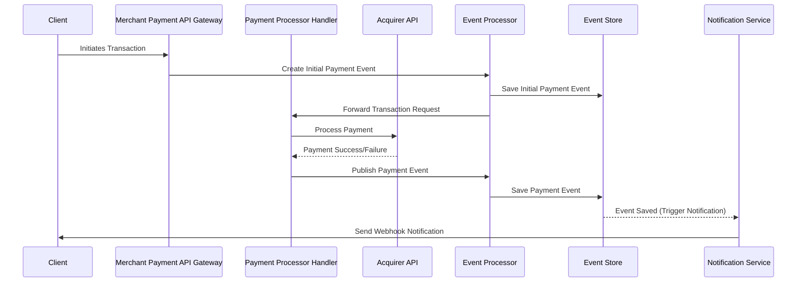

```mermaid
sequenceDiagram
    participant Client
    participant MerchantAPIGateway as Merchant Payment API Gateway
    participant PaymentProcessor as Payment Processor Handler
    participant AcquirerAPI as Acquirer API
    participant EventProcessor as Event Processor
    participant EventStore as Event Store
    participant NotificationService as Notification Service

    Client->>MerchantAPIGateway: Initiates Transaction
    MerchantAPIGateway->>EventProcessor: Create Initial Payment Event
    EventProcessor->>EventStore: Save Initial Payment Event
    EventProcessor->>PaymentProcessor: Forward Transaction Request
    PaymentProcessor->>AcquirerAPI: Process Payment
    AcquirerAPI-->>PaymentProcessor: Payment Success/Failure
    PaymentProcessor->>EventProcessor: Publish Payment Event
    EventProcessor->>EventStore: Save Payment Event
    EventStore-->>NotificationService: Event Saved (Trigger Notification)
    NotificationService->>Client: Send Webhook Notification
```